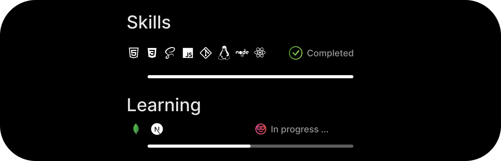

<!---
RajCutinha/RajCutinha is a ✨ special ✨ repository because its `README.md` (this file) appears on your GitHub profile.
You can click the Preview link to take a look at your changes.
--->

# Hallo World, I'm Raj Cutinha

## Frontend Web-Developer

 

&nbsp

&nbsp

&nbsp

 
 

I am a motivated self-taught Frontend Web Developer who specializes in Developing responsive websites from scratch. I am passionate about using modern web technologies to build new applications, focusing on solving problems for different industries and to make people happy with my Work. I am open to learn new things in this field and share my knowledge.

 

